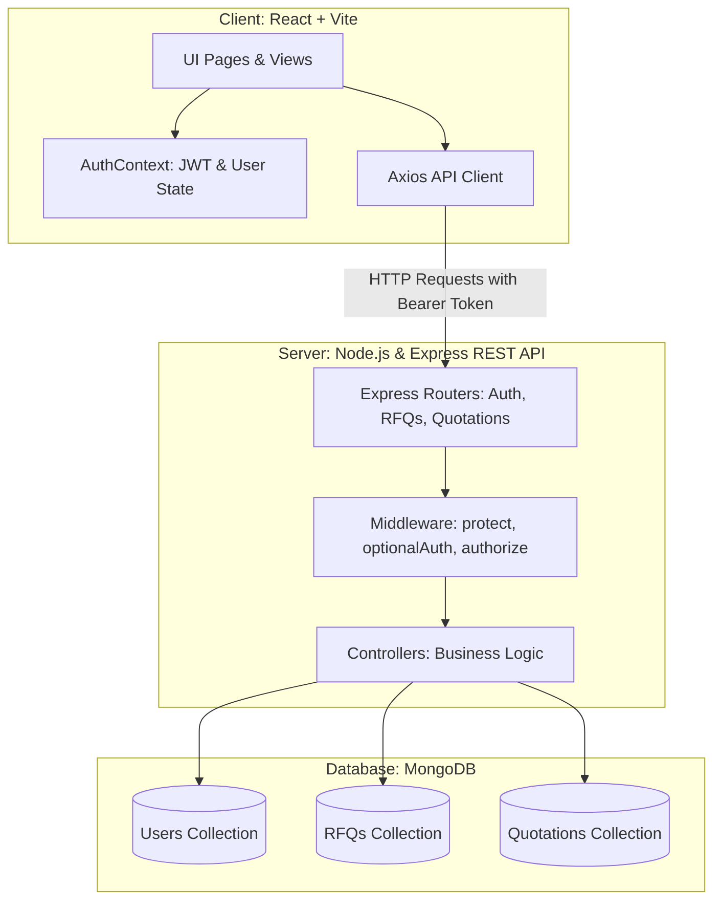

# B2B RFQ Marketplace

> **Full-Stack Software Development Assignment**  
> **Candidate:** AANSHIKESH RAWAT  
> **Live Application URL:** [https://b2-b-merzado.vercel.app](https://b2-b-merzado.vercel.app)  
> **GitHub Repository:** [https://github.com/Aanshikesh/B2B-MERZADO](https://github.com/Aanshikesh/B2B-MERZADO)  
> **Stack:** MERN (MongoDB, Express.js, React.js, Node.js with plain JavaScript)

---

## 🌐 Project Overview

The **B2B RFQ Marketplace** is a full-stack web application designed for enterprise procurement workflows. It enables **Buyers** to post detailed business requirements (Requests for Quotation) and allows **Suppliers** to discover open requirements, evaluate technical specifications, and submit competitive quotations with custom pricing, lead times, and terms.

### Key Features

#### 🏢 Buyer Capabilities
- **User Authentication:** Secure sign-up and login with password hashing (bcrypt) and JWT.
- **RFQ Creation:** Create business requirements specifying product/service name, technical description, quantity, units, delivery location, and submission deadline.
- **RFQ Management:** Edit active RFQs, update technical specifications, adjust deadlines, and toggle status (`open` vs. `closed`).
- **Dashboard & Analytics:** Real-time visibility into Total RFQs, Open Requirements, Closed RFQs, and Total Quotations Received.
- **Quotation Review:** Review and compare all vendor bids submitted for any given RFQ, including unit/total pricing, estimated delivery timelines, supplier notes, and direct contact details.

#### 🏭 Supplier Capabilities
- **Marketplace Discovery:** Browse active business requirements posted by corporate buyers.
- **Search & Filtering:** Real-time search across product names, technical specifications, and delivery locations, plus status filtering (`Open Only`, `All`, `Closed`).
- **Detailed RFQ View:** Inspect complete technical requirements, buyer organization, quantity needed, and deadline constraints.
- **Quotation Submission:** Submit custom bids specifying total quoted price ($), estimated delivery lead time, and terms/notes.
- **Bid Updating:** If a supplier has already quoted on an open RFQ, they can review and update their existing quotation.
- **Quotation Tracking:** Dedicated "My Quotations" workspace summarizing all historical and active bids with total quoted aggregate value.

#### 🛡️ Platform & Security
- **Role-Based Access Control (RBAC):** Express middleware ensures buyers cannot submit quotations and suppliers cannot alter buyer RFQs.
- **Business Logic Guards:** Deadlines are strictly enforced; closed or expired RFQs cannot accept new or updated quotations.
- **Data Validation:** Strict input sanitization and validation on both client and server layers.
- **Evaluator Experience:** Built-in 1-click demo login buttons (`Buyer` and `Supplier`) on the login screen for rapid testing.

---

## 🛠️ Technology Stack

| Layer | Technology | Details |
| :--- | :--- | :--- |
| **Frontend** | React 19 (JavaScript) | Single Page Application scaffolded via Vite for rapid HMR |
| **Routing** | React Router v7 | Client-side routing with role-based `ProtectedRoute` guards |
| **Styling** | Vanilla Modern CSS | Custom B2B design system (CSS variables, glassmorphism, responsive grid) |
| **Icons** | Lucide React | Lightweight, consistent SVG icon set |
| **HTTP Client** | Axios | Configured with request/response interceptors for Bearer JWT handling |
| **Backend API** | Node.js & Express.js | Modular RESTful API (MVC architecture) |
| **Database** | MongoDB | Document database running with Mongoose ODM |
| **Authentication** | JWT & Bcrypt.js | JSON Web Tokens for stateless auth with 10-salt-round password encryption |
| **Dev Tooling** | Concurrently & Nodemon | Concurrent execution of frontend and backend processes |

---

## 🏛️ System Architecture



---

## 🗄️ Database Design & Models

### 1. User Model (`User`)
- `name` (String, required): Full contact name.
- `email` (String, required, unique, lowercase): Login email address.
- `password` (String, required): Bcrypt-hashed password.
- `role` (String, enum: `['buyer', 'supplier']`): Access role.
- `companyName` (String, required): Registered business organization.
- `phone` (String): Business contact number.
- `timestamps`: Automatic `createdAt` and `updatedAt`.

### 2. RFQ Model (`RFQ`)
- `title` (String, required): Product or service requirement title.
- `description` (String, required): Technical specifications, tolerances, and standards.
- `quantity` (Number, required, min: 1): Quantity required.
- `unit` (String, default: 'units'): Measurement unit (e.g., pieces, kg, boxes).
- `deliveryLocation` (String, required): Target delivery facility or city.
- `deadline` (Date, required): Cutoff date for supplier bids.
- `status` (String, enum: `['open', 'closed']`, default: 'open').
- `buyer` (ObjectId, ref: 'User', required): Reference to the creating buyer.
- `timestamps`: Automatic `createdAt` and `updatedAt`.

### 3. Quotation Model (`Quotation`)
- `rfq` (ObjectId, ref: 'RFQ', required): Reference to the associated RFQ.
- `supplier` (ObjectId, ref: 'User', required): Reference to the quoting vendor.
- `price` (Number, required, min: 0.01): Quoted total price in USD.
- `estimatedDeliveryTime` (String, required): Delivery lead time (e.g. "5 business days").
- `notes` (String, required): Payment terms, material certs, freight terms.
- `status` (String, enum: `['submitted', 'accepted', 'declined']`, default: 'submitted').
- `compoundIndex`: `{ rfq: 1, supplier: 1 }` ensures one active bid per supplier per RFQ (with updates supported).
- `timestamps`: Automatic `createdAt` and `updatedAt`.

---

## 🚀 Getting Started (Local Setup)

### Prerequisites
- **Node.js** (v18 or higher recommended)
- **MongoDB** running locally on `mongodb://127.0.0.1:27017` (or a MongoDB Atlas URI)
- **npm** (v9 or higher)

### 1. Clone the Repository
```bash
git clone https://github.com/Aanshikesh/B2B-MERZADO.git
cd B2B-MERZADO
```

### 2. Environment Configuration
Create a `.env` file in the `server/` directory (or copy from `server/.env.example`):
```ini
PORT=5000
MONGODB_URI=mongodb://127.0.0.1:27017/b2b_rfq_db
JWT_SECRET=super_secret_jwt_key_for_b2b_rfq_marketplace_2026
JWT_EXPIRE=30d
```

### 3. Install Dependencies
Run the following from the root directory to install all dependencies:
```bash
# Root dependencies
npm install

# Server dependencies
npm --prefix server install

# Client dependencies
npm --prefix client install
```

### 4. Seed the Database with Realistic Demo Data
Run the built-in database seeder to create sample Buyers, Suppliers, open/closed RFQs, and quotations:
```bash
npm run seed
```

### 5. Run the Full Application
Start both the Express backend (`http://localhost:5000`) and the Vite frontend (`http://localhost:5173`) concurrently:
```bash
npm run dev
```

Open your browser and navigate to:
```
http://localhost:5173
```

---

## 🔑 Pre-Seeded Demo Credentials

For quick evaluation, click the **Buyer** or **Supplier** demo buttons on the Sign In page, or enter these manually:

| Role | Email | Password | Company |
| :--- | :--- | :--- | :--- |
| **Buyer** | `buyer@market.com` | `password123` | Apex Manufacturing Ltd. |
| **Supplier** | `supplier@market.com` | `password123` | Precision Metal Works Inc. |
| **Supplier 2** | `supplier2@market.com` | `password123` | Global Polymer & Hardware Solutions |

---

## 📡 REST API Reference

### Authentication (`/api/auth`)
| Method | Endpoint | Access | Description |
| :--- | :--- | :--- | :--- |
| `POST` | `/api/auth/register` | Public | Register a new Buyer or Supplier account |
| `POST` | `/api/auth/login` | Public | Authenticate user and return JWT |
| `GET` | `/api/auth/me` | Private | Retrieve authenticated user profile |

### Requests for Quotation (`/api/rfqs`)
| Method | Endpoint | Access | Description |
| :--- | :--- | :--- | :--- |
| `GET` | `/api/rfqs` | Public | Browse all RFQs (supports `?search=keyword` & `?status=open`) |
| `GET` | `/api/rfqs/my` | Buyer | Fetch all RFQs created by authenticated buyer with quote counts |
| `POST` | `/api/rfqs` | Buyer | Create a new RFQ |
| `GET` | `/api/rfqs/:id` | Public / Auth | Get RFQ details (returns received bids to owner, or own bid to supplier) |
| `PUT` | `/api/rfqs/:id` | Buyer | Update RFQ specifications or change status (`open`/`closed`) |

### Quotations (`/api/quotations`)
| Method | Endpoint | Access | Description |
| :--- | :--- | :--- | :--- |
| `POST` | `/api/quotations` | Supplier | Submit a new quotation or update an existing bid |
| `GET` | `/api/quotations/my` | Supplier | Retrieve all quotations submitted by the authenticated supplier |
| `GET` | `/api/quotations/rfq/:rfqId` | Buyer (Owner) | Retrieve all quotations submitted for a specific buyer RFQ |

---

## 🌐 Deployment Instructions

The application can be deployed online using modern cloud hosting platforms:

### Option A: Render.com (Recommended for Monorepo / MERN)
1. **Database:** Create a free MongoDB database cluster on [MongoDB Atlas](https://www.mongodb.com/cloud/atlas) and obtain the connection string (`mongodb+srv://...`).
2. **Backend Web Service:**
   - Connect your GitHub repository to Render.
   - Set **Root Directory** to `server`.
   - Build Command: `npm install`
   - Start Command: `npm start`
   - Environment Variables:
     - `MONGODB_URI`: `<Your MongoDB Atlas connection string>`
     - `JWT_SECRET`: `<Secure 32+ char secret string>`
     - `NODE_ENV`: `production`
3. **Frontend Static Site (or Vercel):**
   - Connect repository to Render or Vercel.
   - Set **Root Directory** to `client`.
   - Build Command: `npm run build`
   - Output Directory: `dist`
   - Add environment variable `VITE_API_URL` pointing to the deployed backend URL.

---

## 💡 Assumptions & Technical Decisions

1. **JavaScript Simplicity:** The project uses plain JavaScript throughout both frontend and backend to eliminate TypeScript configuration overhead, ensuring clean, easily auditable code that can be explained smoothly during a live interview.
2. **One Active Quote per Supplier per RFQ:** A compound index (`rfq + supplier`) is enforced in MongoDB. If a supplier quotes on an RFQ they have already quoted on, the API updates their existing bid rather than creating conflicting duplicates.
3. **Strict Deadline Enforcement:** Quotation submission is automatically rejected if an RFQ's deadline has passed or if the buyer has closed the requirement.
4. **Transparent Buyer Review:** Buyers can review all competing vendor quotes with complete contact information to facilitate procurement decisions.
5. **No Bulky Third-Party CSS Frameworks:** The UI is constructed with vanilla CSS using design tokens, ensuring zero styling conflicts, complete layout control, and fast load times.
